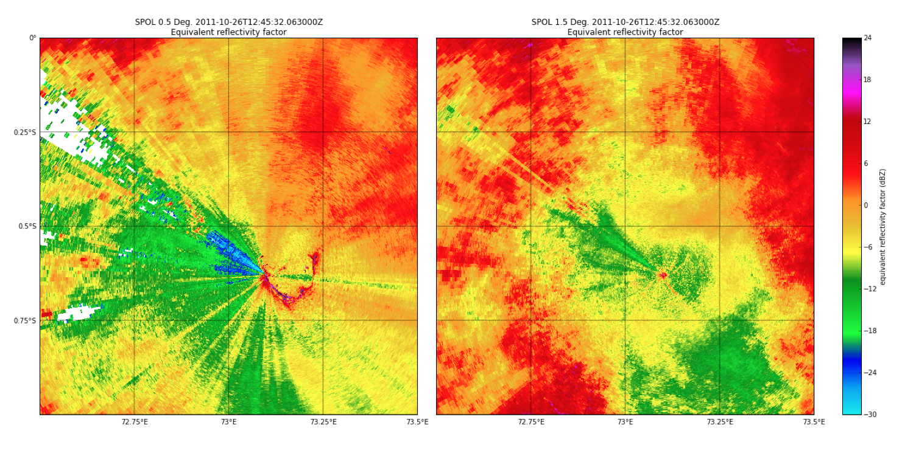

===============================================
Design for Clutter Analysis for the ENA X-SAPR2
===============================================

Introduction and Aims
=====================
stuff

Methodology
===========

Averageing

   
   Figure 1: Average reflectivity from 28 SPOL PPI scans. Left hand panel is the
   lowest tilt at 0.5 degrees and the right hand is at 1.5 degrees. The outline
   of the island is clearly seen as clutter and severe beam blockage from
   ironwood trees nearby can be seen radiating to the west. The beam blockage is
   still aparent but less so at 1.5 degrees.
