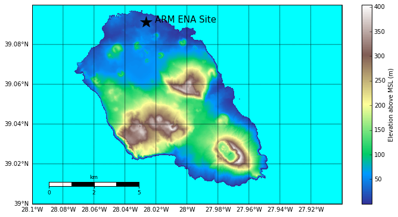
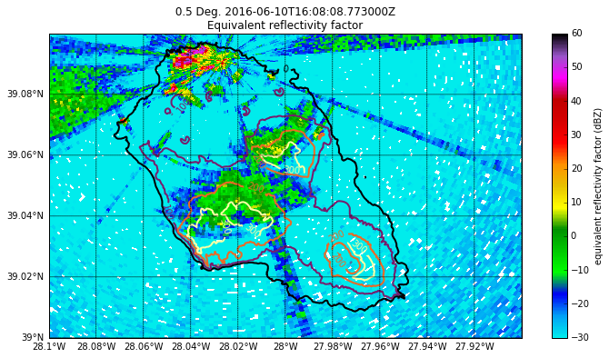
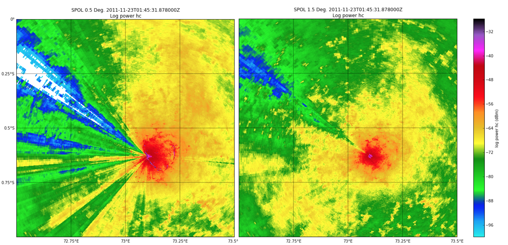
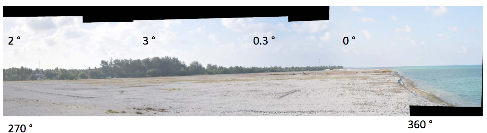
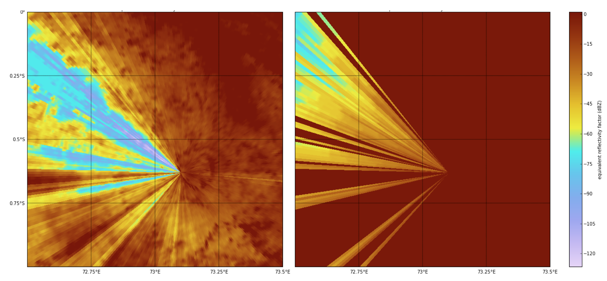

===============================================
Design for Clutter Analysis for the ENA X-SAPR2
===============================================

Introduction and Aims
=====================
The Scanning ARM X-band Radar version 2 (X-SAPR2) is located on Graciosa Island the Azores in the Eastern Northern Atlantic (ENA). The terrain for the island is shown in figure 1. The island is very small and has very steep terrain with three distinct volcanic structures: Lower left is the Sierra Branca complex, upper structure is the Sierra das Fontes complex and on the lower right tip of the island is the Caldera volcano or "central unit" (see figure 5 of [1]). 

   Figure 1: Terrain of Graciosa Island in the Azores. Note the small size of
   the island.

This causes significant clutter and beam blockage. Figure 2 shows very early
data from the radar being run in test mode. Clutter, caused by the nearby volcanic structures,  is clearly seen in the uncorrected reflectivity. The purpose of this work is to characterize beam blocking by terrain and obstruction by other objects not captured in the terrain data. 

   
   Figure 2: 0.5 degree constant elevation scan from the X-SAPR two with contour
   lines of terrain height overlaid. The Sierra Branca and Sierra das Fontes are apparent in the
   clutter but the Central Caldera behind appears conpletely blocked.
 

Methodology
===========
Beam blockage due to terrain can be calculated geometrically using a digital
elevation model file and assuming 4/3 earth radius propagation. We will be using
the BeamBlock method from the open source PyRadarMet [2]. This allows arbitrary
scan patterns to be created and blockage flags to be generated. We will build an
interface to the code, through Py-ART, that will calculate terrain induced
reduction in signal for any given scan mode. 

   
   Figure 3: Average reflectivity from 150 SPOL PPI scans. Left hand panel is the
   lowest tilt at 0.5 degrees and the right hand is at 1.5 degrees. The outline
   of the island is clearly seen as clutter and severe beam blockage from
   ironwood trees nearby can be seen radiating to the west. The beam blockage is
   still aparent but less so at 1.5 degrees.

Not all features that obstruct the propagation of the radar pulse are captured
in digital elevation maps. Often objects such as trees, silos and other natural
and man-made structures can partially or completely obscure the radar beam. To
calculate the impact of this we will us data from the radar itself. The
following examples leverage the NCAR S-POL radar to illustrate the methodology
that will be used for X-SAPR2. Figure 3 shows the averaged reflectivty (with
averaging being carried out in linear units) over 150 radar volumes over three
distinct precipitation events. If enough precipitation events are collected,
unless there is a bias caused by some sort of mesoscale phenomena, the
reflectivity should be fairly uniform. The left hand panel of figure 3 shows the
0.5 deg accumulation with an area of blockage to the west. The right hand panel,
showing the 1.5 degree elevation, shows a very narrow region of partial
blockage. 

   
   Figure 4: Picture taken from the SPOL side showing ironwood trees on the
   horizon. A small section with taller trees is present and accounts for the
   beam blockage in the 1.5 degree tilt. 

The photo in figure 4 shows siting pictures for S-POL with a stand of ironwood
trees clearly shown with a small patch higher than the rest. These are the cause
of the blockage. The exact method to create a map of blockage caused attenuation (in dB) or flag will be a subject of some trail and error of existing literature. However for the purposes of illustration we experimented with an implementation in the process of writing this report.

   
   Figure 5: The lefthand panel shows a 30 point butterworth smoothed
   accumulated power with the mean (taken far enough away and at tilts
   unaffected by blockage) subtracted in log space. The right hand panel is
   derived from the left hand panel by differentiating the signal and, in rays
   impacted by blockage removing positive gradients and re-integrating. This is
   an example of how a blockage map would be created. 

The left hand panel of figure 5 was derived by subtracting (in log space, so
dividing) an average reflectivity at elevations that would not contain blockage.
The data was then passed through a 20 point boxcar smoother. We still see,
however, some undulations and increases in signal with range. This is unphysical
if interpreted as an attenuation map. This is could be due to some residual
variability in the reflectivity patterns or, perhaps some sidelobe
contamination. 

The right hand side of figure 5 was obtained by first identifying rays with
possible blockage then differentiating the signal in those rays and
re-integrating setting areas of positive gradient to zero. Rays not identified
as being corrupted by blockage are set to 0 dB. While the result is far from
perfect is shows a methodology to get to a data based result. 

Once the X-SAPR2 is operational the radar engineering team will perform very
finely stepped constant elevation scans when meteorological returns are present.
Using the aforementioned or enhanced techniques we will average over these
volumes to create a very large data base of observed attenuation. 

We will write code which will interrogate the data base for a given elevation,
azimuth and gate spacing which will then interpolate the saved data and return
the attenuation for that ray.

This will allow a new blockage pattern to be calculated any time the scanning
mode is changed. 

These techniques (the DEM based and data based techniques) are general to any
radar so can be easily transported to other systems within the ARM program.

Effort, staff and Impact
========================
This task will be carried out by Scott Collis at Argonne National Laboratory with assistance from Jonathan Helmus as the task has components the cross aspects of the radar plan. It is expected this project, due to the complexity and need to capture data, will cross into FY17. A rough estimate is around 160 hours of effort. 

here is no impact on operations, however the work will delay other products work being carried out by Translator team at Argonne.

[1] Hipólito, A., Madeira, J., Carmo, R. and Gaspar, J.L. (2013) Neotectonics of Graciosa Island (Azores): a contribution to seismic hazard assessment of a volcanic area in a complex geodynamic setting.  Annals of Geophysics 56 (6), S0677.

[2] https://github.com/nguy/PyRadarMet
